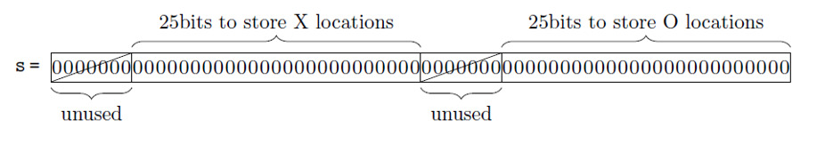

# Done together with Massimo Porcheddu and Miriam Ivaldi

# State of art
Before starting we did some research to better understand the game and Quixo strategies.
Once we had documented about the game we moved on to improve our knowledge of reinforcement-learning algorithms and how these could be applied to the game of Quixo.
We found different articles about these topics, the most useful was probably “Quixo is solved” Satoshi Tanaka, François Bonnet, Sébastien Tixeuil & Yasumasa Tamura, the article is downloadable from this link: https://arxiv.org/abs/2007.15895 and the relative github repository is available at this link: https://github.com/st34-satoshi/quixo-cpp

Here we acknowledged mainly 2 things: 
Quixo game states could be saved in 8 bytes (watch below) 
It would take around 2 weeks to train a RL algorithm to cover all the possible states
Quixo is a game that ends in a draw if both player play perfectly

Hence, we evaluated the option to make a similar RL algorithm with some constraints in order to reduce the number of possible states

# Q-Learning
## Introduction
At first we tried emulating what we have seen in the state of art research by developing a Q-Learning algorithm. 
In our experience with Tic-Tac-Toe, it took 6 minutes to train an agent which stored around 3k different states, so before starting developing the code we focused on understanding if it could be a feasible solution.

## Q-Learning without an initial state
Standard version of Quixo includes a 5 x 5 board, which makes 25 tiles. 
Each tile can be empty, X or O. 
This makes $2 * {3^{25}}$ different states which is something around 1600 billions! 
It was clearly not feasible so we started thinking about a different approach.

## Q-Learning with an initial state
We realized that once the game board is fully covered, a tile cannot have an empty state anymore, this would reduce the complexity of the algorithm drastically, passing from $2 * {3^{25}}$ to $2 * {2^{25}}$ which is about 66 million possible states. 
To start filling the board we thought about mixing our Q-Learning agent with a min-max agent or a fixed rule agent which could quickly fill the board in order to activate our Q-Learning agent.

## Final considerations
We went a bit further with initial constraints in order to try to reduce the number of possible states. 
In our final attempt we noticed that once the board is filled, the number of X and O cannot be changed. 
So starting from a full board (i.e. 13 X and 12 O) we have $2 * \dfrac{25!}{13! * 12!} $ possible states which is around 10  millions.  
We realized this was still a really high number and too many things could have gone wrong, that’s why in the end we decided to proceed with a min-max strategy.

# Min Max
## Introduction
First of all, we searched for some resources online and we found an implementation of a min-max algorithm to solve tic-tac-toe game. (https://stackabuse.com/minimax-and-alpha-beta-pruning-in-python/). We tried to adjust this code to Quixo. 
We tested it first on a 3x3 board and we obtained excellent results. We implemented the pruning strategy (alpha-beta strategy) to reduce the execution time (it reduced the execution time from 5 s to 0,5 s).

## From 3x3 board to 5x5 board
The challenge involved transitioning from a 3x3 to a 5x5 board. To address this, we implemented a "depth" strategy inside the min-max algorithm. This strategy, as implied by its name, limits the exploration to a certain depth within the tree of potential subsequent moves. It's crucial to note that, unlike tic-tac-toe, there's a possibility of never reaching a leaf node due to the risk of getting stuck in an infinite loop. While this method is relatively quick and yields fairly impressive outcomes against a random player, our satisfaction with the results was still not complete...

## Smarter agents
Although the current model already wins against the random player, it doesn’t work well against a human player. The agent was basically “blind” in the first stages of the game since the end of the game would be too far. 
Hence we decided to implement some heuristics to give our agent a clearer direction in earlier stages of the game 
## Final agent
### Heuristics
Gain points when: 
Add a new tile of its symbol into the board  
Make a combo (consecutive pieces) 
Winning match 

Lose points when:  
Opponent adds a new tile of its symbol into the board 
Opponent makes a combo 
Opponent wins the match 

We gave different scores in order to set a priority between them such as that: 

Winning match > add a new tile > make a combo (4 or less)

### Depth
Depth is the value that sets how many moves ahead the AI can look through.
Higher values of depth give better results, but also increase execution time, we found the right balance at depth = 4

Note: depth has a higher value the closer the state is to the current state 

When checking if we are in a winning state, a higher score is given to states closer to the current state. 
This is done to ensure that the algorithm ends the game in the minimal amount of move when it finds a winning pattern and that values more short-term victories over long-term loss
(i.e. if it wins in the next move, it does not have to worry on upcoming loss after 3 moves)

